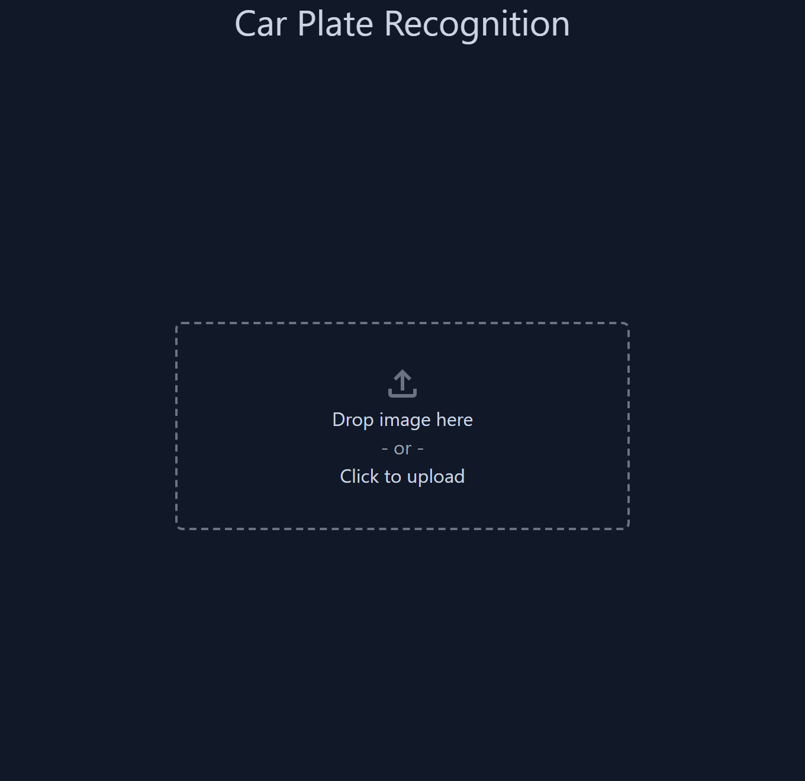
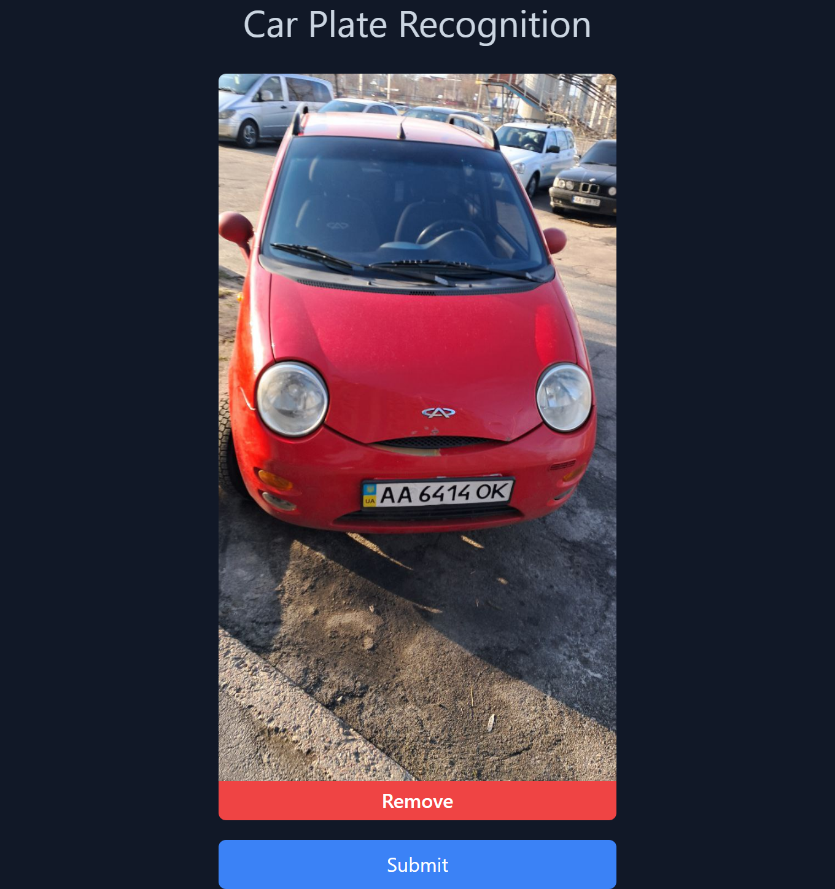
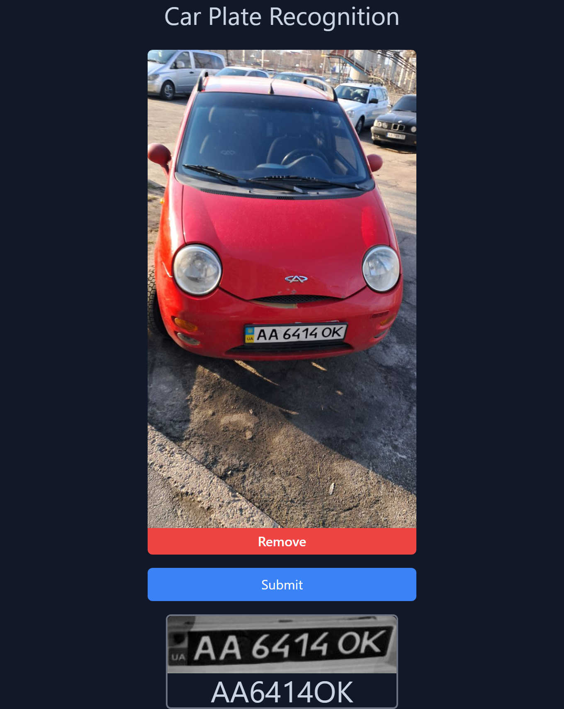

# Car-Plate-Recognition

## Introduction

This project provides an AI-powered solution for recognizing car license plates from images. The system is built with a trained YOLO model for detecting plates and EasyOCR for optical character recognition (OCR) of the plate numbers. The backend is developed using Python, leveraging several libraries to achieve high accuracy and performance. The frontend is built with modern web technologies to provide a seamless user experience.

### Key Features:

-   **License Plate Detection**: Automatically detects car license plates in images.
-   **Optical Character Recognition (OCR)**: Extracts text from the detected license plates.
-   **Cross-Origin Resource Sharing (CORS)**: Configured to allow requests from any origin.
-   **Support for JPEG and PNG**: The system accepts images in JPEG and PNG formats.

### Backend Dependencies:

This project uses the following Python libraries for the backend:

-   [Ultralytics YOLO](https://github.com/ultralytics/yolov5) - For license plate detection.
-   [EasyOCR](https://github.com/JaidedAI/EasyOCR) - For optical character recognition.
-   [Blacksheep](https://github.com/Neoteroi/BlackSheep) - Asynchronous web framework for building the API.
-   [Uvicorn](https://www.uvicorn.org/) - ASGI server for running the API.
-   [NumPy](https://numpy.org/) - For numerical operations.
-   [OpenCV-Python](https://opencv.org/) - For image processing tasks.

### Frontend Dependencies:

The frontend is built using Svelte and Tailwind CSS with the following key dependencies:

-   `@iconify/svelte` - For scalable vector icons.
-   `@sveltejs/adapter-auto` - For automatic deployment.
-   `@sveltejs/adapter-static` - For static site generation.
-   `tailwindcss` - For utility-first CSS styling.
-   `typescript` - For type-safe development.
-   `vite` - For fast development and build processes.

App view:




Watch the demo video: [Link](https://www.youtube.com/watch?v=1vmS6EZZNoo)

## Setup

### 1. Clone this repo:

Navigate to your workspace directory and run:

```bash
git clone https://github.com/0deans/Car-Plate-Recognition.git
```

### 2. Install dependencies and run

Navigate to each folder in the repository and follow the instructions in the README.md files to install the required dependencies and run the project.
